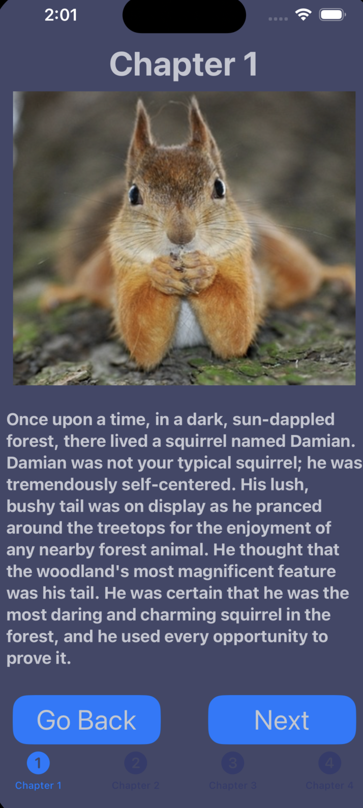
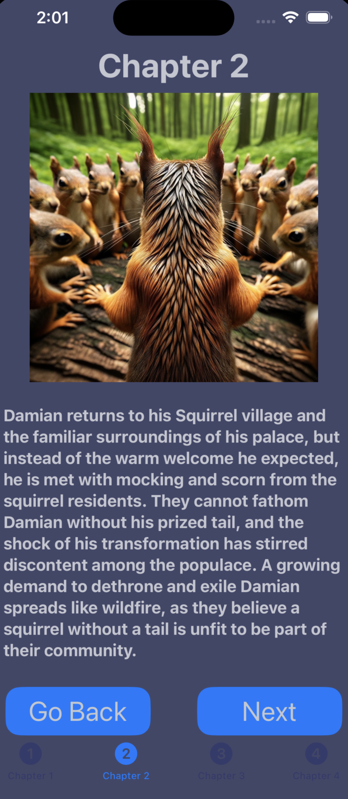
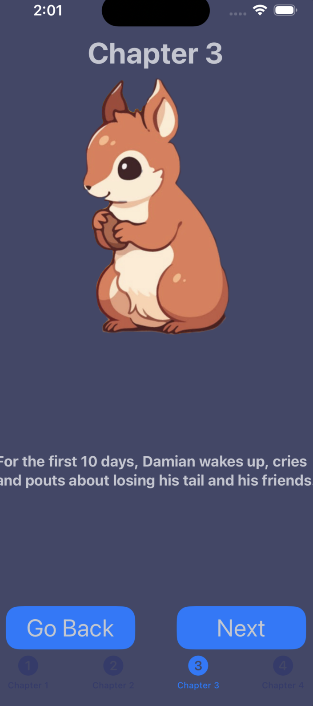
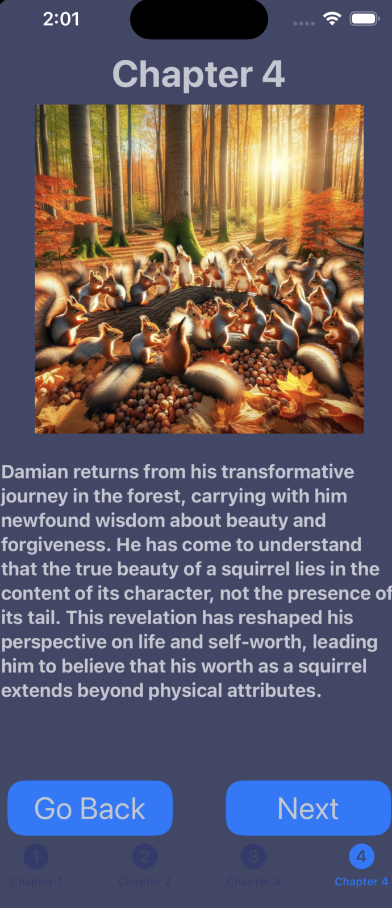

# TaleofTaillessSwiftUI

A SwiftUI-based interactive story template with multiple chapters.

## Table of Contents
- [Introduction](#introduction)
- [Chapter Structure](#chapter-structure)
- [Screenshots](#screenshots)
- [How to Use](#how-to-use)
- [Contributing](#contributing)
- [License](#license)

## Introduction

This project is a SwiftUI-based interactive story template that allows you to create and present a story with multiple chapters. Each chapter includes an image and text, and readers can navigate through the story by clicking "Next" and "Go Back" buttons.

## Chapter Structure

The story is divided into chapters, each represented by a SwiftUI View. Here's an overview of the chapters included in this template:

- **Chapter 1**: Introduction to the main character, Damian, and his self-centered nature.
- **Chapter 2**: Damian's transformation and exile from his squirrel village.
- **Chapter 3**: Damian's 40-day journey into the forest, where he learns valuable lessons.
- **Chapter 4**: Damian returns to his village, sharing his newfound wisdom.

Each chapter includes an image and a piece of text that advances the story. The navigation between chapters is handled through SwiftUI's `@State` properties.

## Screenshots

*Chapter 1: Introduction to Damian*

*Chapter 2: Damian's Exile*

*Chapter 3: Damian's Journey in the Forest*

*Chapter 4: Damian's Return*

## How to Use

To use this template for your own interactive story:

1. Clone this repository to your local machine.
2. Customize each chapter's content by updating the `storyBlock` array in the respective SwiftUI View files (e.g., `Chapter1View.swift`, `Chapter2View.swift`, etc.).
3. Add your own images and text for each chapter.
4. Customize the navigation logic if needed.
5. Build and run the SwiftUI app on your device or simulator.

Feel free to modify the design, colors, and styles to match your story's theme.

## Contributing

Contributions are welcome! If you'd like to contribute to this project, please follow the standard GitHub fork and pull request workflow. Feel free to report issues or suggest improvements.

## License
